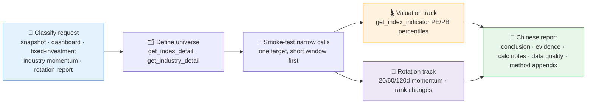

# 🌡️ Index Valuation & Rotation Skill

[简体中文](README.md) | **English**

> Is the index expensive right now? Which industries are gaining strength? — Turns index PE/PB history into a percentile-based "valuation thermometer", and industry returns into 20/60/120-day momentum rankings and rotation signals, delivered as a reproducible valuation dashboard with fixed-investment references.

**Creator / Maintainer**: [`abgyjaguo`](https://github.com/abgyjaguo)

<p align="center">
  
  
  
  
  
  
</p>

---

## 📖 What is this

`index-valuation-rotation` is an **Agent Skill** that does two things:

1. **Index valuation dashboard**: pulls index PE/PB history (at least 5 years by default), computes the current value's historical percentile, maps it to a temperature band, and overlays 20/60/120-day returns — answering "is it expensive right now?";
2. **Industry rotation analysis**: computes 20/60/120-day industry momentum, current rank, prior rank, rank change, and persistence — identifying leaders, laggards, improving and weakening industries.

Every number is traceable: reports state method names, parameters, data window, latest data date, and whether each value is raw API data or a calculation. **Facts are separated from interpretation** — percentiles and ranks come first; any allocation, fixed-investment, or rotation view is labeled as research interpretation.

> All data contracts come from the sibling skill [`pandadata-api`](https://github.com/quantskills/skill-pandadata-api): `panda_data` parameters and fields are verified first; signatures are never guessed.

---

## ⚡ Analysis Pipeline



---

## 🌡️ Valuation Thermometer

- PE/PB series come from `get_index_indicator`, using **at least 5 years** when available; shorter usable windows are downgraded and explained;
- **percentile = share of historical observations ≤ the latest valid observation**, computed separately for PE and PB;
- default temperature bands (user rules can override):

| Percentile band | Temperature | Meaning |
|---|---|---|
| `< 20%` | 🟢 Low | More expensive 80% of the time historically |
| `20% – 80%` | 🟡 Neutral | Within the historical normal range |
| `> 80%` | 🔴 High | Cheaper 80% of the time historically |

- 20/60/120 trading-day returns from `get_index_daily` are added as recent-performance context;
- evidence columns: `index | method | latest date | PE | PE percentile | PB | PB percentile | return windows | coverage days/years | note`.

When no universe is given, the default broad-index pool is: **SSE 50, CSI 300, CSI 500, CSI 1000, ChiNext Index** (上证50、沪深300、中证500、中证1000、创业板指); industry indexes are added only after coverage is confirmed.

---

## 🔄 Industry Rotation

- Prefer direct **industry index** data when a reliable index exists; otherwise aggregate constituents via `get_industry_constituents` + `get_stock_daily`, stating the aggregation rule in the output;
- market-cap weighting is used only when the required weight/capitalization fields are available — otherwise **equal weighting, explicitly labeled**;
- computes 20/60/120 trading-day momentum, current rank, prior rank, rank change, and persistence of improvement or deterioration;
- when asked how rotation affects a broad index, uses `get_index_weights` and reports weight coverage and date before attributing impact;
- identifies leaders, laggards, improving and weakening industries with representative constituents — **never turned into trading orders**.

---

## 🗂️ Method Map

| Need | Primary methods |
|---|---|
| Index candidates and confirmation | `get_index_detail` |
| Index PE/PB valuation series | `get_index_indicator` |
| Index quotes and window returns | `get_index_daily` |
| Industry taxonomy | `get_industry_detail` |
| Industry constituents | `get_industry_constituents` |
| Index constituent weights | `get_index_weights` |
| Constituent-level aggregation | `get_stock_daily` |

---

## 🚀 Quick Start

### 1️⃣ Install (together with pandadata-api)

```bash
# Claude Code (global)
cp -r skill-pandadata-api             ~/.claude/skills/pandadata-api
cp -r skill-index-valuation-rotation  ~/.claude/skills/index-valuation-rotation

# Codex (global, Agent Skills standard directory recommended)
mkdir -p ~/.agents/skills
cp -r skill-pandadata-api            ~/.agents/skills/pandadata-api
cp -r skill-index-valuation-rotation ~/.agents/skills/index-valuation-rotation

# Cursor (project level)
mkdir -p .cursor/skills
cp -r skill-pandadata-api            .cursor/skills/pandadata-api
cp -r skill-index-valuation-rotation .cursor/skills/index-valuation-rotation
```

### 2️⃣ Ask in natural language

```text
沪深300现在贵不贵？给我看估值分位
做一个宽基指数的估值温度计仪表盘
最近哪些行业在走强？给我行业动量排名和轮动信号
中证500适合定投吗？从估值纪律角度给个参考
```

### 3️⃣ Deliverable structure

```
Conclusion → Evidence tables (valuation / momentum) → Calculation notes (percentile · return windows · rank change · aggregation rule)
→ Data-quality notes (lag · missing · partial history) → Method & parameter appendix → Disclaimer
```

Output is Chinese Markdown by default; HTML/dashboard artifacts are generated only on explicit request.

---

## 📦 Directory Layout

```
index-valuation-rotation/
├── SKILL.md                  # Skill entry: core rules, workflow, valuation & rotation methodology, output standards
├── LICENSE                   # GNU GPL v3.0
└── agents/
    ├── openai.yaml           # OpenAI/Codex adapter
    ├── cursor-rule.mdc       # Cursor project-rule adapter
    └── portable-loader.md    # Generic loader for agents without native skill discovery
```

### Cross-Agent Use

| Runtime | How |
|---|---|
| Claude Code / Codex | Load this folder directly (`$index-valuation-rotation`) |
| Cursor | Use `agents/cursor-rule.mdc` as project rule; keep the folder under `.cursor/skills/index-valuation-rotation` |
| Hermes / OpenClaw | Install into their skill roots to load `SKILL.md`; paste `agents/portable-loader.md` if native discovery is unavailable |

---

## 📐 Core Constraints

| Constraint | Description |
|---|---|
| 🧾 Contract first | Every real call is verified against `pandadata-api` for parameters and fields; no guessed signatures |
| 🆔 Confirm identifiers | Indexes via `get_index_detail`, industries via `get_industry_detail`, before any analysis |
| 🔍 Traceable numbers | Every number carries method, parameters, data window, latest data date, raw vs calculated label |
| ⚖️ Facts vs interpretation | Percentiles and ranks first; allocation/fixed-investment/rotation views labeled as research interpretation |
| 📅 Date alignment | Absolute dates and the latest completed trading day; lagged, missing, or partial histories marked explicitly |
| 🗣️ No deterministic advice | Fixed-investment references framed as valuation discipline and risk budgeting, not personalized advice |

---

## ⚠️ Disclaimer

Reports are generated from public data and rule-based analysis, for research reference only. Nothing here constitutes investment advice.

## 📄 License

This project is released under the GNU General Public License v3.0, SPDX identifier `GPL-3.0-only`. See [LICENSE](LICENSE).

## 🐼 PandaAI / QUANTSKILLS Community

<div align="center">
  
  <br>
  <sub>Scan the QR code to join the PandaAI community for QUANTSKILLS skills, agent workflows, and quantitative research practice.</sub>
</div>
