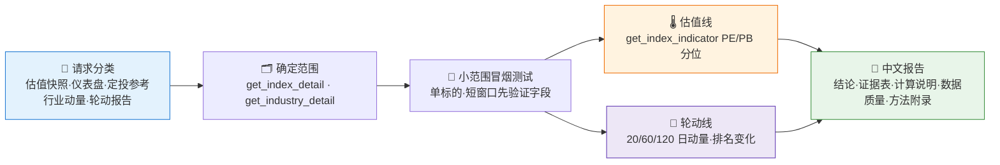

# 🌡️ Index Valuation & Rotation Skill

**简体中文** | [English](README.en.md)

> 指数现在贵不贵？哪个行业在走强？—— 把指数 PE/PB 历史分位算成"估值温度计"，把行业涨跌算成 20/60/120 日动量排名与轮动信号，输出可复算的估值仪表盘与定投参考。

**创建者 / 维护者**：[`abgyjaguo`](https://github.com/abgyjaguo)

<p align="center">
  
  
  
  
  
  
</p>

---

## 📖 这是什么

`index-valuation-rotation` 是一个 **Agent Skill**，做两件事：

1. **指数估值仪表盘**：拉取指数 PE/PB 历史序列（默认至少 5 年），计算当前值在历史中的分位数，套上估值温度带，再叠加 20/60/120 日收益，回答"现在贵不贵"；
2. **行业轮动分析**：计算行业 20/60/120 日动量、当前排名、上期排名、排名变化与持续性，识别领涨/领跌/改善/走弱的行业。

每个数字都可追溯：报告标注接口方法、参数、数据窗口、最新数据日期，并区分原始数据与计算值；**事实与解读分开** —— 先给分位和排名，再把配置、定投、轮动观点标注为研究解读。

> 数据契约一律来自姊妹技能 [`pandadata-api`](https://github.com/quantskills/skill-pandadata-api)：先核对 `panda_data` 方法参数与字段，不猜签名。

---

## ⚡ 分析流水线



---

## 🌡️ 估值温度计

- PE/PB 序列来自 `get_index_indicator`，默认取**至少 5 年**；可用窗口更短时降级标注并说明原因；
- **分位数 = 历史观测值中 ≤ 最新有效值的比例**，PE 与 PB 分开计算；
- 默认温度带（用户可自定义规则）：

| 分位区间 | 温度 | 含义 |
|---|---|---|
| `< 20%` | 🟢 低估区 | 历史上 8 成时间比现在贵 |
| `20% – 80%` | 🟡 中性区 | 处于历史常态区间 |
| `> 80%` | 🔴 高估区 | 历史上 8 成时间比现在便宜 |

- 叠加 `get_index_daily` 的 20/60/120 个交易日收益作近期表现参照；
- 证据表列：`指数 | 方法 | 最新日期 | PE | PE分位 | PB | PB分位 | 收益窗口 | 覆盖天数/年数 | 备注`。

未指定标的时，默认宽基池为：**上证50、沪深300、中证500、中证1000、创业板指**，行业指数在确认覆盖后再加入。

---

## 🔄 行业轮动

- 优先用可靠的**行业指数**直接计算；不可用时用 `get_industry_constituents` + `get_stock_daily` 聚合成分股，并在输出中写明聚合规则；
- 仅在权重/市值字段可用时用市值加权，否则用**等权并明确标注**；
- 计算 20/60/120 个交易日动量、当前排名、上期排名、排名变化、改善/恶化的持续性；
- 用户问轮动对宽基指数的影响时，用 `get_index_weights` 并先报告权重覆盖率与日期再做归因；
- 识别领涨、领跌、改善中、走弱中的行业及代表性成分股 —— **不转化为交易指令**。

---

## 🗂️ 接口映射

| 需求 | 主要接口 |
|---|---|
| 指数候选与确认 | `get_index_detail` |
| 指数 PE/PB 估值序列 | `get_index_indicator` |
| 指数行情与区间收益 | `get_index_daily` |
| 行业分类体系 | `get_industry_detail` |
| 行业成分股 | `get_industry_constituents` |
| 指数成分权重 | `get_index_weights` |
| 成分股行情聚合 | `get_stock_daily` |

---

## 🚀 快速开始

### 1️⃣ 安装（与 pandadata-api 一起）

```bash
# Claude Code（全局）
cp -r skill-pandadata-api             ~/.claude/skills/pandadata-api
cp -r skill-index-valuation-rotation  ~/.claude/skills/index-valuation-rotation

# Codex（全局，推荐 Agent Skills 标准目录）
mkdir -p ~/.agents/skills
cp -r skill-pandadata-api            ~/.agents/skills/pandadata-api
cp -r skill-index-valuation-rotation ~/.agents/skills/index-valuation-rotation

# Cursor（项目级）
mkdir -p .cursor/skills
cp -r skill-pandadata-api            .cursor/skills/pandadata-api
cp -r skill-index-valuation-rotation .cursor/skills/index-valuation-rotation
```

### 2️⃣ 直接用自然语言提问

```text
沪深300现在贵不贵？给我看估值分位
做一个宽基指数的估值温度计仪表盘
最近哪些行业在走强？给我行业动量排名和轮动信号
中证500适合定投吗？从估值纪律角度给个参考
```

### 3️⃣ 交付物结构

```
结论 → 证据表（估值/动量） → 计算说明（分位·收益窗口·排名变化·聚合规则）
→ 数据质量说明（滞后·缺失·部分历史） → 方法与参数附录 → 免责声明
```

默认输出中文 Markdown；仅在用户明确要求可视化产物时才生成 HTML/仪表盘文件。

---

## 📦 目录结构

```
index-valuation-rotation/
├── SKILL.md                  # 技能入口：核心规则、工作流、估值与轮动方法论、输出标准
├── LICENSE                   # GNU GPL v3.0
└── agents/
    ├── openai.yaml           # OpenAI/Codex 适配
    ├── cursor-rule.mdc       # Cursor 项目规则适配
    └── portable-loader.md    # 无原生 skill 发现能力的 Agent 通用加载器
```

### 跨 Agent 使用

| 运行时 | 方式 |
|---|---|
| Claude Code / Codex | 直接加载本文件夹（`$index-valuation-rotation`） |
| Cursor | `agents/cursor-rule.mdc` 作项目规则，完整文件夹放 `.cursor/skills/index-valuation-rotation` |
| Hermes / OpenClaw | 装入各自 skill 根目录加载 `SKILL.md`；无原生发现能力时粘贴 `agents/portable-loader.md` |

---

## 📐 核心约束

| 约束 | 说明 |
|---|---|
| 🧾 先查契约 | 真实调用前先经 `pandadata-api` 核对方法参数与字段，不猜签名 |
| 🆔 先确认标的 | 指数用 `get_index_detail`、行业用 `get_industry_detail` 确认后再分析 |
| 🔍 数字可溯源 | 每个数字标注方法、参数、数据窗口、最新数据日期，区分原始值与计算值 |
| ⚖️ 事实与解读分开 | 先给分位与排名，配置/定投/轮动观点一律标注为研究解读 |
| 📅 日期对齐 | 用绝对日期与最新完整交易日；滞后、缺失、部分历史明确标注 |
| 🗣️ 不给确定性建议 | 定投参考定位为"估值纪律与风险预算"，不是个性化投资建议 |

---

## ⚠️ 免责声明

本报告基于公开数据与规则化分析生成，仅供研究参考，不构成任何投资建议。

## 📄 许可证

本项目以 GNU General Public License v3.0 发布，SPDX 标识为 `GPL-3.0-only`。详见 [LICENSE](LICENSE)。
